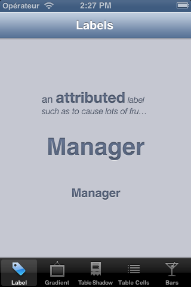
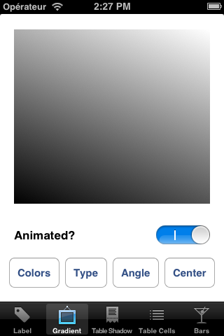
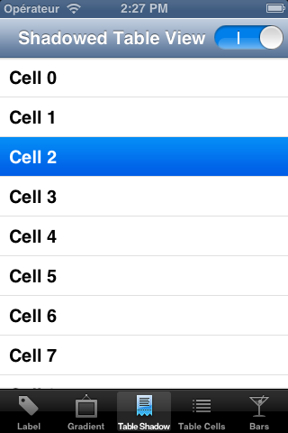
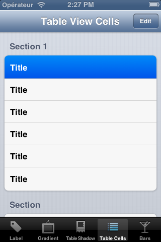
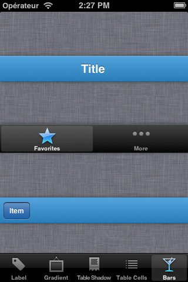

AZAppearanceKit
===============

Overview
--------
AZAppearanceKit is a series of UI and drawing-related Objective-C components primarily targetted at iOS. They may incidentally work on OS X, but it is not the primary target.

Components
----------

### AZLabel

`AZLabel` is a subclass of `UILabel` with enhanced features. It has advanced drawing properties for text color, outer shadows, inner shadows, text gradients, text insets, and horizontal and vertical alignment. Drawing properties can be changed per control state (like highlighted or selected) just like `UIButton`.

`AZLabel` supports all native features of UILabel, including `numberOfLines`, text truncation, and attributed strings on iOS 6 or above.

Currently, `AZLabel`'s method of calculating how to draw gradients and shadows is intensive and slower than native. Under ideal conditions - no frame changes, no property changes - this calculation only has to happen once and drawing is otherwise faster than native. We are currently investigating making the drawing closer to native specifications.

`AZLabel` is designed to be used in many places at once for single-line, decorated text. It is particularly suited for table view cells (as long as the frame of the label is considered), navigation bar title views, and so on.

`AZLabel` does not detect URLs or create links.

Use of `AZLabel` in a project requires linking against Core Text.

### AZGradient

`AZGradient` is a completely compatible port of `NSGradient` to iOS, with the only difference being that we use `UIColor` and `CGColorSpaceRef` over `NSColor` and `NSColorSpace`. If you're creative with `(id)` casts, the class should be usable on either platform with no code changes. `AZGradient` is aliased to `NSGradient` on OS X.

### AZGradientView

`AZGradientView` is a view for displaying a layer-backed gradient, powered by `AZGradient`. A given gradient can be drawn with a settable angle or relative center position in a linear or radial style, respectively. All properties inherently support being animated.

### AZShadowedTableView

`AZShadowedTableView` is a drop-in subclass of `UITableView` that draws shadows at the top and bottom of the view, as well as along the top and bottom of the cells as they scroll. Such a similar effect can be seen in apps like Tweetbot.

### AZTableViewCell

`AZTableViewCell` allows radical appearance customization for both grouped and plain table view cells only without any special methods other than implementing `-tableView:heightForRowAtIndexPath:`. You can change the background colors/gradients, change the border, add a shadow, or alter the corner radius. All changes animate correctly as a cell moves throughout a table view.

How to Use
----------

Add the header and implementation files contained in the `AZAppearanceKit` folder to your project. A CocoaPods spec is also available.

License
-------

Copyright (c) 2012 [Alexsander Akers](http://alexsander.ca) & [Zachary Waldowski](http://dzzy.us).

Permission is hereby granted, free of charge, to any person obtaining a copy of this software and associated documentation files (the "Software"), to deal in the Software without restriction, including without limitation the rights to use, copy, modify, merge, publish, distribute, sublicense, and/or sell copies of the Software, and to permit persons to whom the Software is furnished to do so, subject to the following conditions:

The above copyright notice and this permission notice shall be included in all copies or substantial portions of the Software.

THE SOFTWARE IS PROVIDED "AS IS", WITHOUT WARRANTY OF ANY KIND, EXPRESS OR IMPLIED, INCLUDING BUT NOT LIMITED TO THE WARRANTIES OF MERCHANTABILITY, FITNESS FOR A PARTICULAR PURPOSE AND NONINFRINGEMENT. IN NO EVENT SHALL THE AUTHORS OR COPYRIGHT HOLDERS BE LIABLE FOR ANY CLAIM, DAMAGES OR OTHER LIABILITY, WHETHER IN AN ACTION OF CONTRACT, TORT OR OTHERWISE, ARISING FROM, OUT OF OR IN CONNECTION WITH THE SOFTWARE OR THE USE OR OTHER DEALINGS IN THE SOFTWARE.

Screenshots
-----------

